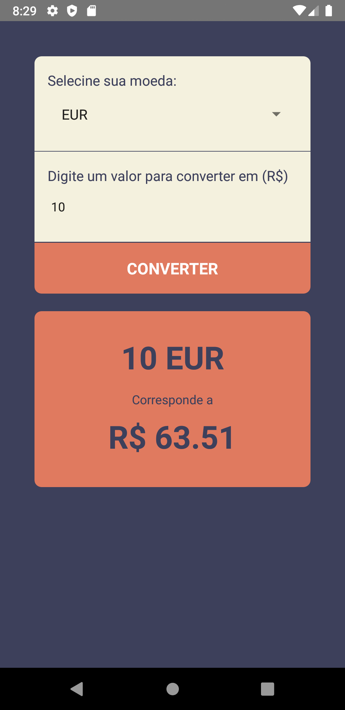

# Conversor de moedas

Projeto de conversor de moedas desenvolvido em React-Native e Tailwind.

## Testar

  
Como faço para testar?

  <ul style="margin-top: 5px, font-size: .7rem">
    <li>Clone este repositório na sua máquina.</li>
    <li>Abra o emulador do Android Studio.</li>
    <li>Entre no CMD e vá até a pasta do repositório clonado e digite: <code>npx react-native run-android</code> ou <code>yarn android</code> (caso tenha o Yarn instalado na sua máquina). </li>
  <ul>

 
Feito isso, o emulador reproduzirá exatamente essas telas no seu computador.

## Mais informações

Para saber mais detalhes do funcionamento do app: [Wiki](https://github.com/wesleysantossts/conversor-de-moedas/wiki/Página-Inicial)
    
# Contribuição
    
Agradecimento especial aos contribuidores do projeto.
    
<table>
  <tr>
    <td border="1px solid #ddd" align="center">
      <a href="https://github.com/wesleysantossts">
        
         
        <b>Wesley Santos</b> 
      </a>
    </td>
  </tr>
</table>
